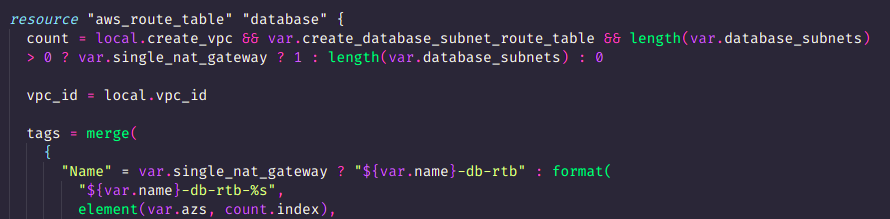
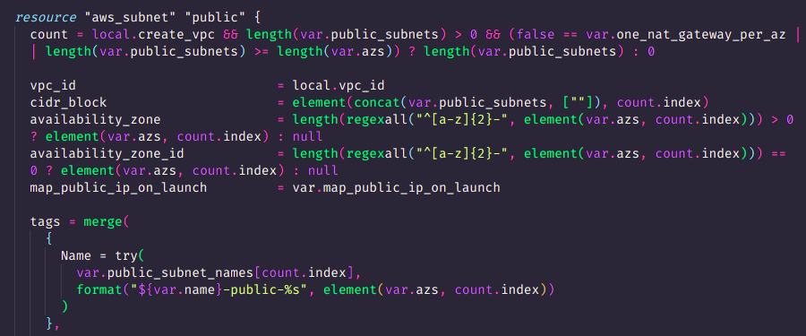

### This explains some of the concepts and why it is done a particular way

This checks :
- Create VPC is true
- Create DB Route table is true
- Database subnets exists
- If the single NAT is true then we need to create only one route table coz all subnet will be attached to single NAT
- But if nat_per_az or nat_per_subnet is true then each subnet will have different NAT so we need to create different routing table for each subnet.
  

This checks:
- Create VPC is true
- Public subnet variable is not empty
- If one_nat_per_az is true then no. of public subnet should be greater than azs else we will not be able to create one NAT per AZ

Also in cidr_block in the code we concat extra empty list ([""]) coz the count will one greater than actual index value therefore so that our count.index does not goes out of range we added one extra empty value

And in `availability_zone` and `availability_zone_id` we check weather user has passed az or az id in the input. It is done by checking first three character of the each entry in az and if it starts with `ap-` or `us-`  then it is az name else it is a az id which generally are like `use1-az3` or `use1-az1` ,etc

**AWS Docs says that for different AWS account the mapping of AZs can be different for users so therefore you can use az ids instead. Reade [here](https://docs.aws.amazon.com/ram/latest/userguide/working-with-az-ids.html)**

